# graphviz介绍
Graphviz 是一个开源的图可视化工具，非常适合绘制结构化的图表和网络。Graphviz 使用一种叫 DOT 的语言来表示图形。

## 安装
在Mac上使用`homebrew`安装非常简单，在终端中输入以下命令即可：
```
brew install graphviz
```

## 一般形式
```
graph filename {
  a -- b -- c;
  b -- d;
}
```
保存为`filename.dot`文件后，需要在终端切入到文件所在目录，输入以下命令：
```
dot filename.dot -T png -o filename.png
```
这样，在该目录下就会生成一个图片文件`filename.png`。


## 解释
1. 可分为有向图和无向图，分别用`digraph`、`graph`表示。
2. 默认情况下图是从上到下布局的，通过设置`rankdir=LR`可以让图从左到右布局。
3. 节点和边有许多属性，可以自定义，如`label`、`shape`、`color`、`style`等。可以单独对每个节点和边设置不同的属性，也可以统一设定。
4. 利用`subgraph`定义子图。表示图的结构，对节点和边进行分组。提供一个单独的上下位文设置属性。针对特定引擎使用特殊的布局，如果subgraph的名字以cluster开头，所有属于这个子图的节点会用一个矩形和其他节点分开。
5. 同一个节点分块。更多内容见[这里](http://www.graphviz.org/doc/info/shapes.html)

```dot
digraph structs {
    node [shape=record];
    struct1 [label="<f0> left|<f1> mid&#92; dle|<f2> right"];
    struct2 [label="<f0> one|<f1> two"];
    struct3 [label="hello&#92;nworld |{ b |{c|<here> d|e}| f}| g | h"];
    struct1:f1 -> struct2:f0;
    struct1:f2 -> struct3:here;
}
```



